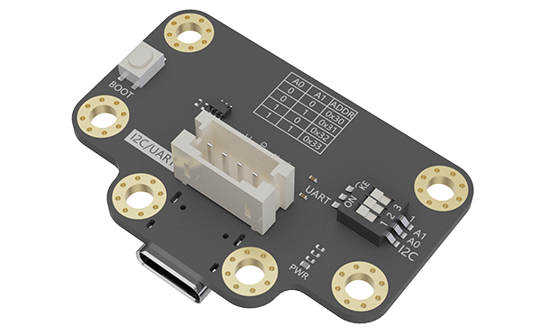
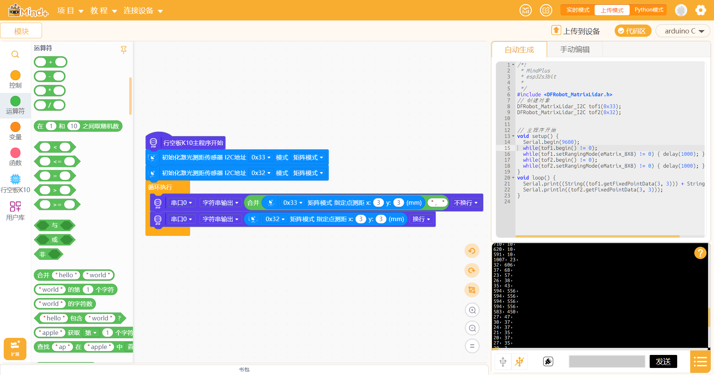
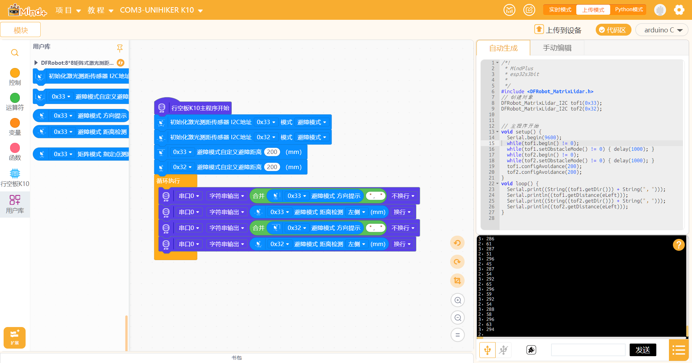
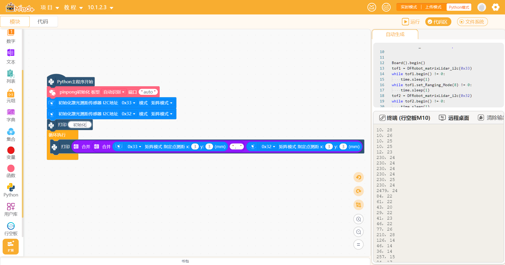
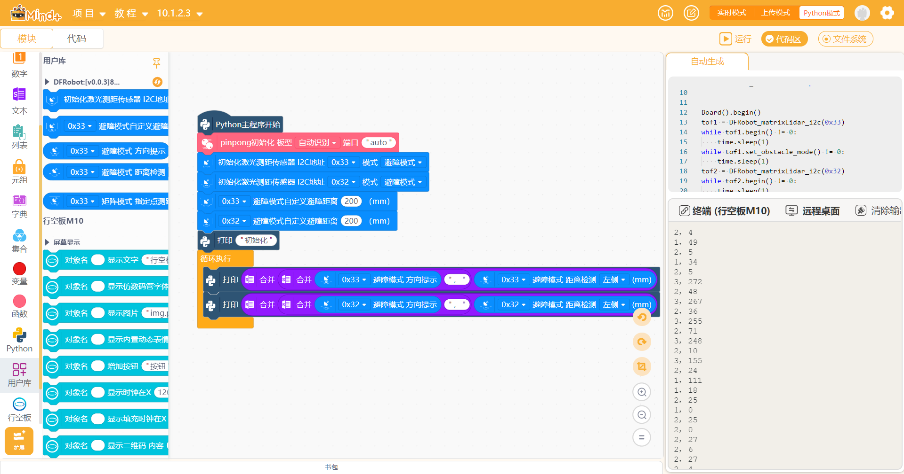

# 8x8 矩阵式激光测距传感器



## 描述

这是一个用于 Mind+ ArduinoC 模式的 8x8 矩阵式激光测距传感器扩展，基于 DFRobot `DFRobot_MatrixLidar` 官方 Arduino 库修改。

传感器支持 8x8 矩阵测距和避障模式，可在约 20mm-3500mm 范围内检测距离。

## 功能

- 支持 I2C 地址：`0x33`、`0x32`、`0x31`、`0x30`
- 支持多个传感器同时接入，不同地址会生成不同对象
- 支持矩阵模式指定点测距
- 支持避障模式方向提示
- 支持避障模式左侧、前方、右侧距离检测
- 避障方向和距离积木会在库内部自动获取最新避障数据，无需额外调用“获取避障数据”

## 地址对象映射

扩展会根据 I2C 地址自动生成不同对象：

| I2C地址 | 生成对象 |
| --- | --- |
| `0x33` | `tof1` |
| `0x32` | `tof2` |
| `0x31` | `tof3` |
| `0x30` | `tof4` |

例如同时使用 `0x33` 和 `0x32` 时，生成代码类似：

```cpp
DFRobot_MatrixLidar_I2C tof1(0x33);
DFRobot_MatrixLidar_I2C tof2(0x32);
```

## 积木说明

### 初始化

先使用“初始化激光测距传感器 I2C地址 [ADDRESS] 模式 [MATRIX]”积木。

- 矩阵模式：初始化对应地址为 8x8 矩阵测距模式
- 避障模式：初始化对应地址为避障模式

如果使用多个传感器，每个地址都需要初始化一次。

### 矩阵模式

使用“[ADDRESS] 矩阵模式 指定点测距 x:[X] y:[Y]”积木读取指定坐标距离。

坐标范围：

- `x`: 0-7
- `y`: 0-7

### 避障模式

避障模式下可直接使用：

- “[ADDRESS] 避障模式 方向提示”
- “[ADDRESS] 避障模式 距离检测 [SIDE]”
- “[ADDRESS] 避障模式自定义避障距离 [DISTANCE]”

方向和距离积木会自动调用库内部的避障数据获取逻辑。

## 教程示例

### 上传模式

- 矩阵模式



- 避障模式



### Python模式

- 矩阵模式



- 避障模式




## 支持列表

| 主板型号 | ArduinoC |Python | 备注 |
| --- | :---: |:---: |  --- |
| Arduino Uno | √ || I2C |
| Arduino Nano | √ || I2C |
| Leonardo | √ || I2C |
| Mega2560 | √ || I2C |
| ESP32 | √ || I2C |
| 行空板K10 | √ || I2C |
| 行空板M10 | |√ | I2C |
| micro:bit | √ || I2C |


## 更新日志

V0.1.0 修改部分积木,新增M10主控
